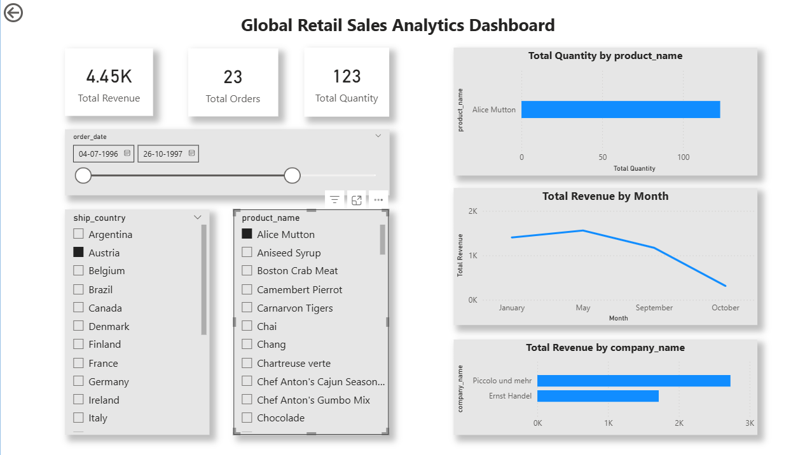

# Global Retail Sales Analytics Dashboard

## 📊 Project Overview
This project analyzes retail sales data using PostgreSQL and Power BI to generate business insights.

## 🛠 Tools Used
- PostgreSQL
- Power BI
- DAX

## 📈 Features
- KPI metrics: Total Revenue, Orders, Quantity
- Interactive dashboard with slicers
- Customer, product, and country analysis

## 💡 Key Insights
- Top customers contribute most of the revenue
- Sales vary across regions
- Certain products dominate sales

## 📸 Dashboard Preview

